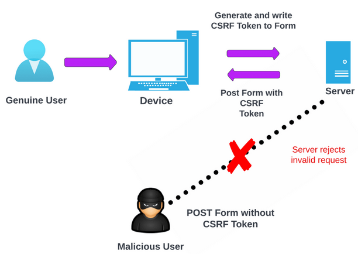

# การสร้างแบบฟอร์มใน Laravel

### 🔐 CSRF Field (ฟิลด์ป้องกันการปลอมคำขอ)

ทุกครั้งที่มีการสร้างฟอร์ม HTML ในแอปพลิเคชันของ Laravel ควรจะเพิ่มฟิลด์ CSRF (hidden field) ลงในฟอร์มด้วย เพื่อให้ middleware ของ Laravel สามารถตรวจสอบความถูกต้องของคำขอได้ เราสามารถใช้คำสั่งของ Blade Template ในการสร้างฟิลด์ CSRF ได้ด้วยคำสั่ง @csrf

### ❓ CSRF คืออะไร?

CSRF ย่อมาจาก Cross-Site Request Forgery เป็นเทคนิคโจมตีรูปแบบหนึ่ง ที่ผู้ไม่หวังดีหลอกให้ผู้ใช้ทำคำสั่งโดยไม่รู้ตัว (เช่นกดลิงก์ แล้วข้อมูลถูกส่ง HTTP Request ไปที่เว็บโดยผู้ใช้ไม่ตั้งใจ) เพื่อไปกระทำการบางอย่างที่เป็นอันตรายต่อผู้ใช้งาน



### ✅ Laravel ป้องกัน CSRF อย่างไร?

Laravel มี middleware ชื่อว่า ValidateCsrfToken ซึ่งจะทำการตรวจสอบว่า คำขอที่ส่งมานั้นมี CSRF token ที่ถูกต้องหรือไม่หากไม่มีระบบจะปฏิเสธคำขอทันที

- ผู้ใช้สร้างฟอร์ม Laravel และใส่ CSRF Token ลงไปใน <input type="hidden" name="_token">
- ผู้ใช้ส่งฟอร์ม (POST, PUT, PATCH, DELETE)
- Middleware ตรวจสอบว่าค่า \_token ตรงกับ token ใน session หรือไม่
- ถ้าตรง ✅ → ให้ผ่าน
  ถ้าไม่ตรง ❌ → คืนค่า 419 Page Expired

```
<form method="POST" action="/submit">
    @csrf  {{-- แทรก CSRF token อัตโนมัติ --}}

    <input type="text" name="name">
    <button type="submit">ส่งข้อมูล</button>
</form>
```

##### เมื่อ render แล้ว browser จะเห็นโค้ด HTMLดังนี้

```
<form method="POST" action="/submit">
    <input type="hidden" name="_token" value="eyJpdiI6I...">
    <input type="text" name="name">
    <button type="submit">ส่งข้อมูล</button>
</form>
```

# Validation data

Laravel มีระบบ Validation ที่ใช้งานง่าย อ่านเข้าใจได้ และขยายต่อได้ดี สามารถใช้ตรวจสอบข้อมูลที่ผู้ใช้งานกรอกในฟอร์ม หรือข้อมูลจาก API request ต่าง ๆ

```
public function login_page(Request $request)
{
    if (!empty($request->input())) {
        $request->validate([
            "email" => "required|email:rfc,dns",
            "password" => "required"
        ], [
            "email.required" => "กรุณาระบุ email",
            "email.email" => "รูปแบบ email ไม่ถูกต้อง",
            "password.required" => "กรุณาระบุ password",
        ]);

        return redirect('/')->with('loginResult', 'login success!');
    } else {
        return view('login');
    }
}
```

# Validation Errors

คำสั่ง @error ใช้เพื่อตรวจสอบข้อผิดพลาดจากการ validation ข้อมูลที่ส่งมาว่าถูกต้องตามประเภทฟิลด์ที่ระบุหรือไม่?
ภายในคำสั่ง @error เราสามารถแสดงข้อความผิดพลาดโดยใช้ตัวแปร $message

```
<form action="login" method="POST" class="flex flex-col gap-4">
    @csrf

    <div class="flex flex-col gap-1">
        <label for="email">Email:</label>
        <input type="email" id="email" name="email" />
    </div>
    <div class="flex flex-col gap-1">
        <label for="password">Password:</label>
        <input type="password" id="password" name="password" />
    </div>

    <input type="submit" value="เข้าสู่ระบบ"
        class="rounded bg-indigo-600 text-white px-2.5 py-1 w-fit mx-auto cursor-pointer" />

    //กรณี success
    @if (session('loginResult'))
        <p class="text-green-700 mx-auto">{{ session('loginResult') }}</p>
    @endif

    //กรณี error
    <p class="text-red-700 mx-auto">
        @error('email')
            {{ $message }}
        @enderror
        @error('password')
            {{ $message }}
        @enderror
    </p>
</form>
```

นอกจากแสดงเป็นข้อความผิดพลาดแล้ว ยังสามารถใช้เป็นเงื่อนไขได้ด้วย

```
<label for="email">Email address</label>

<input id="email" type="email" class="@error('email') is-invalid @else is-valid @enderror" />
```

##### ดูกฏเพิ่มเติมได้ที่ลิงค์

[validation rules](https://laravel.com/docs/12.x/validation#available-validation-rules)

# Workshop สร้างฟอร์ม Login

- สร้างไฟล์ /resources/views/login.blade.php
- สร้างฟอ์รมสำหรับ login เข้าสู่โปรแกรมโดยมี input คือ email และ password และปุ่ม submit

# Component

Blade Component คือส่วนย่อยของ UI ที่สามารถใช้ซ้ำและจัดการแยกต่างหาก ทำให้โค้ดดูสะอาด เป็นระบบ และดูแลรักษาง่าย เหมาะกับการพัฒนาเว็บที่มี UI ซับซ้อน

1. แยก UI เป็นโมดูลที่เข้าใจง่าย
2. ใช้ซ้ำได้ในหลายที่ ช่วยลดโค้ดซ้ำ
3. จัดการ logic และ props ในคลาสแยก
4. เขียน Blade ได้สั้น กระชับ และเป็นระบบ

### 📦 1. การสร้าง Component

```
php artisan make:component Button
```

Laravel จะสร้างไฟล์:

- app/View/Components/Button.php – คลาสสำหรับ logic ของ component
- resources/views/components/button.blade.php – view สำหรับ render HTML

### 🔧 2. สร้าง template ให้ component

```
//resources/views/components/button.blade.php
//template ของ component

<button type="submit">{{ $slot }}</button>

//$slot คือ ตัวแปรที่ใช้แทนเนื้อหาภายใน component ซึ่งเราส่งเข้ามาจากภายนอกตอนที่เรียกใช้งาน component
```

### 🔧 3. วิธีใช้ใน Blade

```
//resources/views/login.blade.php

<x-button>เข้าสู่ระบบ</x-button>

//$slot คือ ตัวแปรที่ใช้แทนเนื้อหาภายใน component ซึ่งเราส่งเข้ามาจากภายนอกตอนที่เรียกใช้งาน component
```

### 🔄 4. การสร้าง Attribute และส่งค่าเข้า Component

```
//app/View/Components/Button.php

class Button extends component{
    public string $id;
    public string $class;

    public function __construct(string $id="", string $class="")
    {
        $this->id = $id;
        $this->class = $class;
    }
}

//แก้ไข resources/views/components/button.blade.php
<x-button id="{{ $id }}" class="{{$class}}">เข้าสู่ระบบ</x-button>

//แก้ไข resources/views/login.blade.php
<x-button id="btnSubmit" class="py-2 px-4 bg-blue-600 hover:bg-blue-800">เข้าสู่ระบบ</x-button>
```
